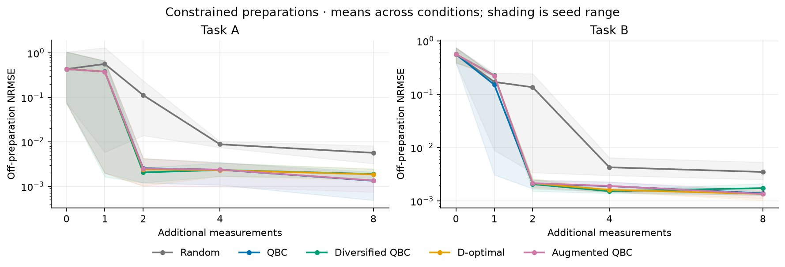
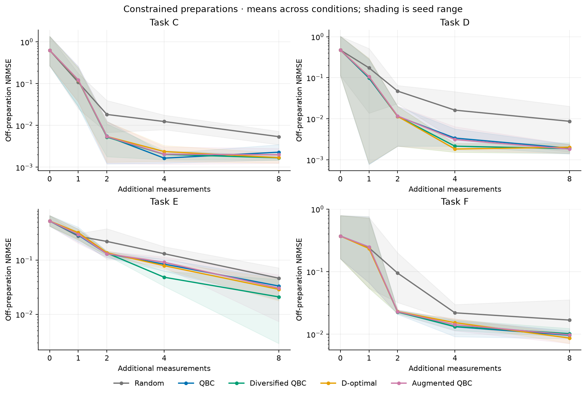

> Historical finite-library pilot report, archived before the overnight extension.
> Test counts and live-freeze statements below refer to the v2 completion checkpoint.
> The protocol link has been updated to its archived copy; the original report bytes
> remain in Git history. See [the current report](REPORT.md) for subsequent work.

# CorrLaw research pilot

Status: COMPLETE — finite-library research pilot, 21 September 2026.

**Result:** explicit admissible alternatives were found, but augmented QBC did not
establish an acquisition advantage over ordinary QBC, diversified QBC or D-optimal
on the final four-task confirmation suite. Its mean AUC was worse than all three
active baselines on each task. All 1,000 final policy units completed, 49 tests pass,
and a preselected substantive result reproduced exactly.

## Question and scope
Do explicit bounded alternative equations improve acquisition of new measurements
when initial observations follow a constrained preparation? The main experiment is
finite-library sparse regression with five acquisition policies: random, ordinary
QBC, library-diversified QBC, regularized D-optimal, and augmented QBC. These are
simulated ideal physical systems, not new physical laws or laboratory observations.

The [v2 protocol](../docs/PROTOCOL_V2.md) fixes all methods and metrics before opening
confirmation outcomes. Development uses A/B with three seeds; confirmation uses
C/D/E/F with five seeds and includes exact/near preparations, output noise,
independent inputs, shuffled marginals and restricted query pools. The full input
freeze is [.research/freezes/v2.json](../.research/freezes/v2.json), source commit
`c15cad8`. Each policy starts with 128 fitting + 64 calibration labels, and may
acquire eight more. Calibration labels count as measurements. Errors are normalized
by physical reference scales, not fitted to hidden-test variance.

[Physical assumptions](../docs/BENCHMARKS.md) and [method details](../docs/METHOD.md)
state the allowed interventions, common incomplete priors, generic grammar,
admissibility limits and exact acquisition rules. All policies use the same point
predictor; only query selection changes. The learner never receives task names,
reference formulas or hidden labels. This is interface separation, not a blind
experiment on the coding agent.

## Established overlap
Committee-based symbolic-regression acquisition is established by
[Medina et al., revised v3](https://arxiv.org/html/2305.10379v3).
Library bagging and feature dropout are established safeguards in
[Ensemble-SINDy](https://arxiv.org/html/2111.10992v1) and
[Nair et al.'s SISSO study](https://arxiv.org/html/2412.05947).
For a symmetric alternative pair f±αq, variance is α²q². Greedy D-optimal gain is
log(1+φᵀM⁻¹φ), which can rank candidates similarly when one weakly observed direction
dominates. [The derivation](../docs/EQUIVALENCE.md) distinguishes this limiting overlap
from exact equality of arbitrary committees. No novelty claim follows from finding
a small singular value. [The source ledger](../docs/RELATED_WORK.md) records what
was actually inspected and the inaccessible publisher page.

## Development evidence
[development-001](../results/runs/development-001/run.json) completed all 360 planned
policy units in 86.23 seconds. [Artifact validation](../results/runs/development-001/validation.json)
checked 21,651 accepted alternatives without errors. On constrained A/B preparations,
mean AUC was 0.07609/0.06413 for augmented QBC, 0.07608/0.05523 for ordinary QBC,
and 0.07625/0.06405 for D-optimal. Thus development did not establish a consistent
advantage over existing active policies. Thresholds were retained for confirmation.
[Full development tables](development/tables.md) and [condition CSV](development/conditions.csv)
include all controls, rather than just favorable cases.



The separate real [PySR smoke](../results/runs/pysr-smoke-001/pysr.json) used PySR
2.5.0 and Julia 1.13.0. The [six-fit static A/B comparison](../results/runs/pysr-compare-001/comparison.json)
used the same arithmetic operators and three search seeds. PySR selected an A alias
with off-preparation error 0.4331 in one seed and the correct expression in two.
On B all three selected functions fit calibration data to approximately machine
precision but had off-preparation RMSE 1.0796–1.0932. This is a small initial-data
engine check, not a PySR five-policy acquisition benchmark. It does not establish
finite-library conclusions for evolutionary symbolic regression. All candidate
expressions, including unsimplified divisions, are preserved for inspection.

## Final held-out confirmation

[confirmation-v2-001](../results/runs/confirmation-v2-001/run.json) completed all
1,000 planned policy units in 328.50 seconds with no execution failures. It comprises
200 paired task/seed/condition trials, each with all five policies. The
[full artifact audit](../results/runs/confirmation-v2-001/validation.json) reconstructed
labels and errors, checked pairing/accounting, and validated 91,325 accepted alternative
records. Repeated alternatives across policies/budgets are not independent discoveries.

The primary normalized AUC (lower is better) for constrained preparations is below.
Average the four width/noise conditions within each seed, then the five seed values.
Controls are reported separately in [complete tables](confirmation/tables.md) and
[condition-level CSV](confirmation/conditions.csv). C is centripetal acceleration;
D kinetic energy; E parallel capacitances; F series capacitances.

| Task | Random | QBC | Diversified QBC | D-optimal | Augmented QBC |
|---|---:|---:|---:|---:|---:|
| C | 0.062314 | 0.056749 | 0.056596 | 0.056959 | 0.057125 |
| D | 0.068581 | 0.045846 | 0.045792 | 0.046289 | 0.046829 |
| E | 0.168850 | 0.132857 | 0.117934 | 0.134922 | 0.135866 |
| F | 0.083528 | 0.064809 | 0.065778 | 0.064716 | 0.066419 |

Augmentation improved mean AUC relative to random sampling on all four tasks, but
its mean AUC was worse than **every established active baseline on all four tasks**.
Diversified QBC beat augmentation on every seed for D and E. The measured incremental
acquisition advantage is therefore not established in this finite-library pilot.

Paired differences below are augmented minus comparator, with observed seed ranges.
Negative favors augmentation; these ranges are descriptive, not confidence intervals.
All seed-level differences against every comparator are retained in
[summary.json](confirmation/summary.json); tiny signed values are floating-point
roundoff in otherwise matching scores.

| Task | ΔAUC vs QBC | Seed range | ΔAUC vs D-optimal | Seed range |
|---|---:|---|---:|---|
| C | +0.000376 | [-7.95e-05, 0.00118] | +0.000166 | [-0.00121, 0.00274] |
| D | +0.000984 | [-6.15e-17, 0.00302] | +0.000540 | [-0.000148, 0.00166] |
| E | +0.003009 | [-0.00274, 0.00866] | +0.000944 | [-0.0072, 0.0137] |
| F | +0.001609 | [-0.00139, 0.00666] | +0.001703 | [-0.000497, 0.00474] |



## What the witnesses and controls show

The system constructed explicit alternatives, but doing so did not ensure better
queries. For one saved exact/noiseless C example (seed 92001), the selected initial
model was v²/u; an inferred alternative was approximately
1.67417794359 v²/u − 0.67417794359 u²/v. Both fit the observed line to about 7×10⁻¹⁶
RMSE under the incomplete-prior numerical contract. The chosen off-line measurement
at (u,v)=(0.5018403,1.4748068) had label 0.17076385; the saved point predictor then
recovered the reference to numerical precision. This is an illustration, not an
independent performance claim or a new physical law. The complete equations, scores
and measurements are in the
[unit record](../results/runs/confirmation-v2-001/units/C-s92001-w0-n0-constrained-augmented_qbc.json).

| Task | Initial witnesses / constrained trials | Off-error at 8, constrained | Off-error at 8, surface-restricted |
|---|---:|---:|---:|
| C | 20/20 | 0.001991 | 0.996147 |
| D | 20/20 | 0.001827 | 2.273918 |
| E | 15/20 | 0.030269 | 1.116843 |
| F | 18/20 | 0.009803 | 0.544790 |

No initial witnesses were accepted in the 80 independent/shuffled task-seed-noise
trials for augmented QBC; some involved poor observational fits, so absence does not
certify specificity or uniqueness. Surface-restricted measurements left substantial
off-preparation error. All query coordinates remained on the permitted surface.
The detector's restricted-pool status is empirical: some near-null alternatives
still vary along that surface, so not every unit receives a no-discriminating-query label.

The difficult representable task E illustrates search failure as well as ambiguity:
at budget 2, both ordinary and augmented QBC triggered false consensus in 18/20
constrained trials. Augmentation did not remove that failure. At budget 8, augmented
QBC had poor observational fit in 10/20 E trials and 10/20 F trials. F lacks an exact
representation in the declared dictionary. These scientific failures remain in
the tables and unit artifacts; they were not counted as process crashes or omitted.

Augmented and D-optimal selected the same first query in 13/20 C, 10/20 D, 14/20 E,
and 10/20 F constrained trials (47/80 overall). This supports practical overlap,
while their remaining choices differ. It does not assert exact equivalence of the
full policies. See [query agreement and diagnostic counts](confirmation/summary.json).

Witness construction averaged 0.147 s per augmented trajectory; recorded batch peak
RSS was 117,653,504 bytes. Common witness instrumentation also runs for the other
policies and is timed separately. These descriptive measurements include evaluator
work and should not be read as isolated acquisition-speed benchmarks.

## Final reproduction and verification

All 49 tests passed. Frozen v2 inputs still verify. The preselected noisy
C-s92001-w0-n0.01-constrained-augmented_qbc result reproduced **exactly** in a fresh
process, including candidate coefficients, witness records, queries and metrics
([reproduction](../results/runs/reproduce-v2-001/reproduction.json)). Only timing and
cumulative process RSS are excluded from scientific equality. The summary JSON,
condition CSV, table and both SVG/PNG figures regenerated byte-for-byte on the
recorded environment ([regeneration check](audit/report_regeneration.json)).

## Audit trail and failed attempts

The first frozen round, [confirmation-v1-001](../results/runs/confirmation-v1-001/run.json),
completed 1,000 policy units; its [artifact audit](../results/runs/confirmation-v1-001/validation.json)
checked 96,345 accepted alternative records. The [first replay record](../results/runs/reproduce-v1-001/reproduction.json)
reported `exact_match=false` while its complete scientific hashes were identical.
The checker compared Python tuples with JSON-loaded lists. This was a checker
false negative, not a numeric mismatch. The failed record was preserved unchanged.

Protocol v2 corrects exact comparison of canonical serialized JSON and uses fresh
seeds 92001–92005. Its regression test also rejects a deliberate 1e-6 metric change;
no numerical tolerance was relaxed. All eight numerical method modules are
unchanged, and the original v1 files still match their committed bytes
([revision provenance](audit/revision_provenance.json)). The first round is retained
as exploratory after the revision, with [all its tables](confirmation-v1/tables.md).
The final result does not silently reuse its seeds as new confirmation.

Other engineering issues were fixed before confirmation: the starter freeze helper
included ignored editable-install metadata; an added test now excludes it while
still detecting real new source files. Initial SVG title/legend overlap was corrected
and the figures inspected. A scoped checkpoint rejected an ignored Finder file,
and another was refused while the runner held its lock; no lock or safeguard was
bypassed. These are engineering failures, not failed scientific hypotheses.

## Limits and interpretation

This is a small, hand-selected suite of ideal algebraic systems with five final
confirmation seeds per task. Seed ranges describe observed variability; they are
not confidence intervals and do not prove a population-wide null effect. Multiple
conditions within a seed and hidden test points are not independent replicates.
All methods share a finite polynomial/Laurent dictionary and greedy sparse search,
so failure can come from search, incomplete observability, noise or misspecification.
Task F deliberately lacks an exact representation. No-witness outcomes certify
neither uniqueness nor the true law. Witnesses are empirical admissible alternatives
within the declared bounds; they are not calibrated posterior probabilities.

The learner is deliberately given incomplete physical priors. Known positivity,
symmetry or boundary conditions could exclude some alternatives. In particular,
the extra origin condition rules out the supplied circle alternative. The symbolic
sanity check tests this, but there is no numerical prior-aware sweep. The square
hidden test also changes marginal coverage relative to a ring; this is not a pure
correlation-only shift. The shuffled control addresses matched marginals separately.

The false-consensus diagnostic can also flag a singleton fallback after poor
observational fit. The separate poor-fit counts must be consulted; it is not a
calibrated confidence or a pure alias-detection measure. Runtime includes evaluation
and common witness instrumentation; peak RSS is cumulative for the batch process,
not isolated per-policy memory. The optional PySR check does not justify conclusions
about its active-acquisition performance. No independent scientific validation,
new physical law, novel optimal-design principle, or publication readiness is claimed.

The next useful research extension would test whether explicit witness explanations
help in a harder, preregistered nonlinear search setting or under equally supplied
physical priors. It should not be framed as an established acquisition improvement.

## Reproduce and inspect

Python 3.14.5 on Apple Silicon macOS; exact Python packages are in
[requirements.lock.txt](../requirements.lock.txt). Optional PySR 2.5.0/Julia 1.13.0
have [Julia project](../configs/JuliaProject.toml) and
[manifest](../configs/JuliaManifest.toml) records. Main experiments need no Julia.
From the repository root, after the [README setup](../README.md):

```sh
.venv/bin/python -m pytest -q
python3 tools/lab.py verify --id v2
OPENBLAS_NUM_THREADS=4 OMP_NUM_THREADS=4 VECLIB_MAXIMUM_THREADS=4 \
  .venv/bin/python -m corrlaw.audit results/runs/confirmation-v2-001 \
  --reproduce C-s92001-w0-n0.01-constrained-augmented_qbc --output work/my-replay
.venv/bin/python -m corrlaw.summarize results/runs/confirmation-v2-001 \
  --output work/my-confirmation-report
python3 tools/completion_check.py
```

Use a new directory/run ID for intentional repeats. Numerical exactness is checked
on this recorded environment; cross-platform floating-point identity is not promised.
Unit JSON files retain every candidate, selected equation, witness, query coordinate,
noise-realization ID, measured label and score. Raw logs and Julia caches are ignored
local files; they were not pushed anywhere. [The claims ledger](../.research/CLAIMS.md)
connects report statements to evidence. The repository supplied the research design;
Codex implemented, executed and reviewed it. This self-review is not independent
peer review. No authorship attribution, license or publication was invented.
