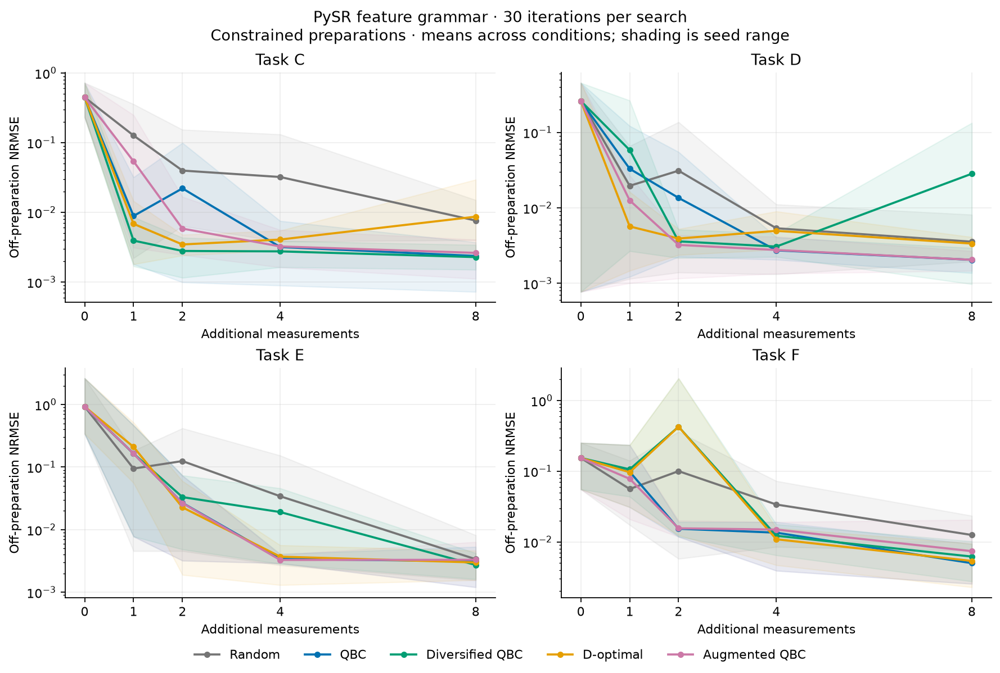
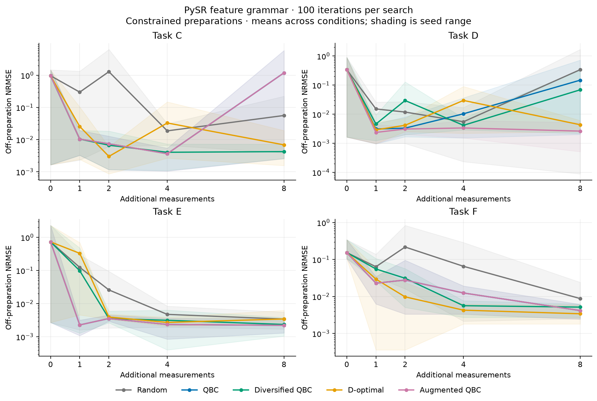
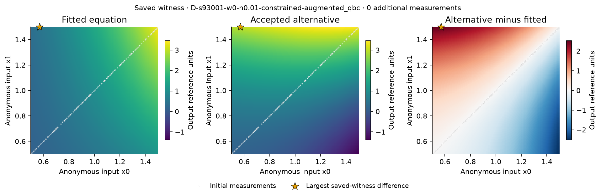
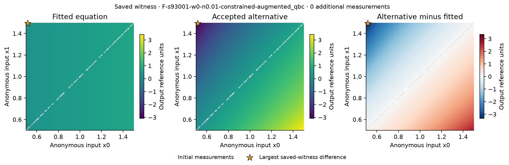

# CorrLaw: symbolic search, ambiguity, and measurement selection

Completed 22 September 2026. All declared experimental tiers, scientific audits,
preselected replays and numerical report regeneration passed within the overnight
budget. Final source tests: 74 passed. All work remains local.

The primary PySR study gives mixed results. Adding explicit alternative equations
has no consistent advantage across all four tasks and active comparators. Its mean
error-curve area is worse than every active baseline on C, slightly better on D,
and nearly tied with ordinary QBC on E and F. Five seeds per task are too few for
broad superiority or no-effect claims. The proposed diagnostic and its use in query
selection are separate questions: an alternative equation can reveal ambiguity
without choosing more useful measurements.

All observations are simulated from ideal algebraic systems. This is a reproducible
small research study, not a newly discovered physical law or a publication claim.
The earlier finite-library pilot is preserved in [PILOT_REPORT.md](PILOT_REPORT.md);
its negative acquisition result is not substituted for the new PySR result.

## Study design

The [v3 protocol](../docs/PROTOCOL.md), [benchmark definitions](../docs/BENCHMARKS.md),
[PySR method](../docs/METHOD_PYSR.md), source, tests, dependencies and configurations
were frozen before opening the new confirmation outcomes: 75 inputs at scientific
commit `5e27579`, recorded in [freeze v3](../.research/freezes/v3.json).

The primary study contains 500 trajectories: C/D/E/F, seeds 93001–93005, five policies,
exact and width-.01 constrained preparations with output noise .01, and independent,
shuffled-marginal and surface-restricted controls at width zero. Each trajectory
starts with 128 fitting plus 64 calibration labels and can acquire eight measurements.
Calibration counts toward the 192-label starting budget. All policies share paired
initial observations, pools, public probes and candidate-indexed query noise. Hidden
same/off-preparation test sets each contain 2,048 points and are used only for evaluation.

The methods are random acquisition, ordinary query by committee (QBC), feature-
diversified QBC, regularized linear-feature D-optimal design, and witness-augmented
QBC. Point selection is identical on identical measurement histories. Actual PySR
search operates over generic normalized feature terminals, with three searches per
refit, 30 iterations per search (with a shared 30-second per-search safety cap), and a
common 15-node search/acceptance arithmetic
cap. This is not raw-variable-only PySR or a direct published-method replication.
Three searches do not imply three retained committee members.

The predeclared secondary tier has 100 trajectories on the exact constrained,
noisy subset, with the same five seeds, tasks and policies, changing only the search
iteration budget from 30 to 100. Noiseless output and width .05 remain in development
but were omitted from new confirmation based on preconfirmation resource evidence.
The secondary subset cannot be compared against the wider primary mean as if it
were a matched treatment. The dedicated comparison uses corresponding unit IDs and
checks matching initial/evaluation data hashes.

AUC is trapezoidal off-preparation RMSE over budgets 0/1/2/4/8, divided by eight.
The output reference scale is one; it is not normalized by hidden test variance.
Conditions are averaged within seed before averaging five seeds. Tables retain all
seed values and paired differences. Seed ranges are descriptive, not confidence
intervals; evaluation points and repeated witness records are not replications.

## Primary results

Mean constrained AUC, lower is better:

| Task | Random | QBC | Diversified QBC | D-optimal | Augmented QBC |
|---|---:|---:|---:|---:|---:|
| C: u²/v | 0.0650615 | 0.0348746 | 0.0304642 | 0.0330418 | 0.0375539 |
| D: uv² | 0.0274721 | 0.0244882 | 0.0324848 | 0.020436 | 0.0200162 |
| E: u+v | 0.106746 | 0.0854488 | 0.0924278 | 0.0905467 | 0.0854027 |
| F: uv/(u+v) | 0.0511725 | 0.0310693 | 0.108838 | 0.106915 | 0.0297253 |

Lower is better. These means pool the two constrained widths within seed. Augmented
minus ordinary-QBC mean differences are approximately +.00267925, −.00447197,
−.00004605 and −.00134396 for C/D/E/F. C is worse on three seeds and tied on two;
E and F each have three ties, one favorable and one unfavorable seed. The small
mean differences on E/F do not establish a reliable improvement.

Paired augmented-minus-QBC AUC differences, after averaging widths within each
seed (negative favors augmentation):

| Task | Seed 93001 | Seed 93002 | Seed 93003 | Seed 93004 | Seed 93005 |
|---|---:|---:|---:|---:|---:|
| C | +0.0111361 | +0 | +0 | +8.80005e-06 | +0.0022513 |
| D | -0.00109218 | +0.000932738 | -0.0126692 | +0 | -0.00953121 |
| E | +0 | -0.000452896 | +0.000222635 | +0 | +0 |
| F | +0 | +0 | +0.000863296 | +0 | -0.00758311 |

The large diversified/D-optimal means on F include a seed-93001 failure and are
not trimmed. A post-hoc inspection of the largest F trajectory AUC selects D-optimal,
width .01: AUC .789733 and budget-two off-preparation RMSE 4.10533 despite same-
preparation RMSE .0239747. The selected rational expression passes the declared
empirical admissibility checks. Its committee spread 1.51534 is high, so it is not
false consensus under the fixed threshold. Finite-probe checks do not establish
absence of poles or global boundedness. This is a failure illustration, not the
preselected witness illustration or a diagnosis of every F outcome. See the
[saved failure record](../.research/notes/confirmation-rational-spike.json).

[All control means](pysr-confirmation/tables.md), [condition-level CSV](pysr-confirmation/conditions.csv),
and [full seed values and paired differences](pysr-confirmation/summary.json) retain
all policies, widths and control conditions. The constrained curves use seed-range
shading, with no outlier removal.



Initial augmented witness coverage is C 7/10, D 8/10, E 5/10 and F 10/10 constrained
trajectories, versus zero across the 40 independent/shuffled trajectories. This
absence is not proof of uniqueness or calibrated specificity: E has one initial
high-error/low-spread flag among its five shuffled-control cases despite no witness.
At budget 8, augmented constrained mean errors are .002618, .002053, .003299 and
.007378 on C/D/E/F. The corresponding surface-restricted control errors remain
.745792, .524744, .951605 and .228305. Restricting measurements to the preparation
surface therefore retains substantial off-preparation error in this study.
Independent/shuffled budget 8 means range from .001467 to .005592 across these
task/control combinations. These are descriptive control contrasts, not claims
that every constrained dataset is unidentified or every independent fit succeeds.
One of ten constrained F augmented cases has the poor-observational-fit diagnostic
at budget 8; it is retained separately from execution failures.

## Search-budget sensitivity

The 100-iteration tier completed all 100 trajectories. Its constrained exact-width
mean AUCs are shown separately below (five seeds, noise .01).

| Task | Random | QBC | Diversified QBC | D-optimal | Augmented QBC |
|---|---:|---:|---:|---:|---:|
| C | 0.360908 | 0.361825 | 0.0655435 | 0.0782469 | 0.361825 |
| D | 0.112465 | 0.0632046 | 0.0462446 | 0.0347343 | 0.0241243 |
| E | 0.0687505 | 0.04812 | 0.0604468 | 0.0895861 | 0.04812 |
| F | 0.0852476 | 0.0234224 | 0.0258102 | 0.017596 | 0.0234224 |

On C/E/F, augmented and ordinary QBC select identical eight-query ID sequences
and have identical AUCs in every seed, despite added witnesses in many initial
committees. D has three favorable seeds, one unfavorable seed and one tie; the
mean gain is largely driven by seed 93003 (paired AUC difference −.179126).
[The saved history comparison](audit/strong-query-histories.json) is post-hoc;
the predeclared paired performance summary is the main comparison.

For augmented QBC, the matched 30→100 iteration AUC changes are C .0481138→.361825,
D .0364928→.0241243, E .118596→.0481200, and F .0389776→.0234224.
More search is not uniformly better. The C mean includes seed 93003 AUC 1.53602:
at budget 8, a rational model has off-RMSE 5.88872, same-preparation RMSE .00116440
and committee spread .524605. This post-hoc largest-C failure remains untrimmed
and is not false consensus. Its saved expression is in the [selected failure record](../.research/notes/strong-rational-spike.json).
The [matched sensitivity summary](compute-sensitivity/summary.json) checks all 100
paired initial/evaluation hashes and retains each seed's paired changes. See the
[stronger-tier table](pysr-confirmation-strong/tables.md),
[seed values](pysr-confirmation-strong/summary.json), and
[full audit](../results/runs/pysr-confirmation-strong-v3-001/validation.json).



## What witnesses and committee disagreement show

The preselected initial examples use seed 93001, width 0, noise .01 and the first
accepted saved witness. C and E have no accepted witness in those prescribed cases;
no more favorable replacements are substituted. Their saved point errors are
1.43749 and .593413, with high augmented spreads .372541 and 1.11942. Absence of an
added witness does not establish uniqueness or imply low ordinary disagreement.
See [C](witness-C/explanation.json) and [E](witness-E/explanation.json).

D's saved fitted expression is approximately `1.00005034 u²v`; its first alternative
adds `.775598921(v³−u³)`. F's fitted expression is approximately `.499748173u`;
its first alternative adds `.596906147u²/v + .250402285v − .847308432v²/u`.
Both differences nearly vanish on the exact diagonal preparation and grow elsewhere.
The recorded observational relation/probe ratios are about 1e-16. Full precision,
fit errors, selected locations and actual queries are in the
[D](witness-D/explanation.json) and [F](witness-F/explanation.json) records.
These are empirical admissible alternatives under incomplete numerical priors;
positivity of either equation is assessed separately below.




A star in a witness plot marks maximum discrepancy for that single pair in the
pool; it need not be the actual query chosen by the combined committee. Empirical
agreement within recorded tolerances is not exact symbolic recovery or a global
physical-validity claim. The preselected origin-only B example has eight saved witnesses and is retained
as [an explanation record](witness-origin-only/explanation.json) and
[illustration](witness-origin-only/witness.png).

The [saved-history diagnostic](committee-pysr/summary.json) evaluates 500 records:
100 augmented trajectories at five reported budgets. Ordinary-committee high-error/
low-spread flags number 8; augmentation reduces that to 5, removing three and adding
none. All three removed flags have valid observational fit. They occur at budget
zero: two near-preparation F cases (seeds 93003 and 93004) and the surface-restricted
E case at seed 93001. There are 13 upward and zero downward spread-threshold
crossings overall; 16 records have poor observational fit. These are repeated
condition/budget records, not 500 independent replications.

The [historical finite diagnostic](committee-finite/summary.json) has 1,000 records,
with 32 high-error/low-spread flags before and after augmentation, no removed or
added flags, 20 upward and zero downward spread crossings, and 91 poor-fit records.
Its grid and seeds differ from PySR, so these counts are not a matched engine effect.
Both diagnostics compare the same point predictor on saved augmented-policy
histories. Later histories are not ordinary-QBC histories. A removed flag changes
a diagnostic, not the fixed predictor, and does not establish better acquisition.
Committee spread is not calibrated confidence.

The descriptive positivity check asks whether **both** equations are nonnegative
on 512 public probes, with 1e-10 numerical slack. Among initial constrained augmented
cases, witness/nonnegative-pair coverage is C 7/10→5/10, D 8/10→8/10,
E 5/10→5/10 and F 10/10→10/10. Corresponding surviving pair counts are
93/300, 159/384, 142/196 and 133/440. In the historical finite study, condition
coverage is C 20/20→17/20, D 20/20→18/20, E 15/20→13/20 and F 18/20→14/20.
See the [PySR](positivity-pysr/summary.json) and
[finite](positivity-finite/summary.json) condition tables.

The first illustrated D and F alternatives have public-probe minima −1.19259 and
−3.00929, respectively, and would fail this additional positivity screen. The
origin-only B illustration also has a negative minimum, −.103386. Other accepted
pairs survive the sampled screen. Thus some ambiguity persists under this check,
but these particular first illustrations are not positive physical alternatives.
No acquisition was rerun with a positivity filter, and finite-probe passes do not
prove global positivity or pole-freedom.

## Search failure versus support restriction

The archived finite v2 pilot completed 1,000 trajectories and found augmented mean
constrained AUC worse than all three active comparators on each C/D/E/F task. The
exploratory follow-up enumerates every one-, two- and three-feature support (833
supports) on 400 archived trajectories at budgets 0/2/8: 1,200 rows, 702 unique fits.
It holds histories fixed and fits ordinary least squares with the existing coefficient
cap and selection score. It does not rerun acquisitions. The old fits permit up to
seven terms, so the support restriction also changes effective regularization.
F remains outside the finite Laurent linear span.

The [same-objective comparison](audit/search-objective.json) distinguishes lower
hidden error from a lower original fitting objective. On E, the enumerated candidate
has lower objective in 80/100, 80/100 and 68/100 rows at budgets 0/2/8; it has lower
hidden error in 90/100, 98/100 and 75/100. Every lower-objective E fit also passes
the recorded observational admissibility checks. These correlated row counts are not
independent replication. On other tasks many improvements in hidden error accompany
higher objective values; such cases alone are not evidence of optimization failure.
The descriptive score roundoff band is 1e-12 and changes no fit threshold.

In the preselected noisy exact-preparation E seed 92001 augmented history at budget
two, the old seven-term fit has off-RMSE .132798. The enumerated three-term fit has
approximately `1.000453 v + 1.001242 u − .002879914 v/u`, off-RMSE .00243237, and a
lower original objective (approximately .000199502 versus .000200971). That is a
concrete better-scoring candidate in the original allowed class, not just a hidden-
error improvement. It is not exact symbolic recovery and does not prove a globally
optimal bounded-coefficient solution. Enumeration covers ordinary least-squares
support fits followed by coefficient filtering, not all possible coefficient choices.

The [full diagnostic audit](../results/runs/search-diagnostic-001/validation.json)
checked all 1,200 rows and exactly replayed the preselected833-support fit.
The separate [read-only objective analysis](../.research/notes/search-objective-check.py)
[regenerated byte-for-byte](audit/search-objective-regeneration.json); it performs
no refits or acquisition changes.

Cross-engine aggregate differences cannot isolate the effect of symbolic search:
grammar, rational composition, fitting, retention, weights, seeds and noise grids
also differ. The old finite/prior diversified baseline uses 18 fitting paths per
refit versus nine for the other policies, because it also fits a separate ordinary
point model. The cost is included in timing. The new PySR study gives all policies
three searches. Historical results are label-efficiency comparisons, not a blanket
claim of equal total computation.

## Physical priors and model-class limits

The exploratory B controls run 300 trajectories: five seeds, two widths, two output
noise levels, five policies, and three prior settings. Corresponding starting and
evaluation data are identical across tiers, verified by saved hashes. All policies
receive the same prior within each tier. Across tiers the available information
changes: exact priors are supplied assumptions, not acquired noisy labels.

Mean prior-control AUC (four conditions averaged within seed):

| Shared prior | Random | QBC | Diversified QBC | D-optimal | Augmented QBC |
|---|---:|---:|---:|---:|---:|
| None | .121567 | .0762809 | .0763174 | .0763030 | .0762489 |
| Known zero at origin | .00348323 | .00187286 | .00182252 | .00187306 | .00184636 |
| Origin plus coordinate evenness | .000890470 | .000899652 | .00102935 | .000952286 | .000899652 |

Supplying the origin prior makes a much larger difference here than differences
among active policies. The initial off-RMSE falls from .777738 to .00225625; adding
coordinate evenness lowers it to .000861944. This does not mean origin knowledge
alone makes the law identifiable. It excludes the simple `1+v²` alias, while odd
cubic circle aliases remain possible. In the degree≤3 dictionary the origin-plus-
evenness prior leaves only u² and v², a very strong model-class restriction.

The exact analytical check makes the dependence on class explicit. For U=u²+2v²
and r²=u²+v², exact circle agreement among degree≤3 polynomials gives
`P−U=(r²−1)(au+bv+c)`. The known zero origin forces c=0; local nonnegativity forces
zero gradient at that point and hence a=b=0. But the degree-four alternative
`U+αr²(r²−1)`, 0<α≤1, agrees on the circle and origin, is even and globally
nonnegative, and differs elsewhere. The positivity bound is
`(1−α)r²+αr⁴ ≥ 0`. It is outside the degree≤3 prior-control dictionary.

For F, the separate family `uv(u+v)/[(u+v)²+λ(u−v)²]`, 0<λ≤1/3, retains degree-one
homogeneity, positivity, symmetry, zero-axis values and monotonicity, and agrees
on the diagonal. Its small-input ratio is 1/(1+λ); a sufficiently precise limiting
prior excludes it. These are analytical class controls, not algorithm-generated
15-node witnesses or novel results. With full units, only the two named inputs and
no additional dimensional parameters, dimensional homogeneity already fixes A/C/D
monomial powers. The numerical benchmarks use incomplete physical priors.

The numerical summaries for [no prior](prior-none/tables.md),
[origin only](prior-zero_origin/tables.md), and
[origin plus evenness](prior-zero_origin_and_even/tables.md) retain all conditions
and seed values. Each tier's full audit passed 100 trajectories and 900 saved models:
[none](../results/runs/prior-control-001/none/validation.json),
[origin](../results/runs/prior-control-001/zero_origin/validation.json),
[both](../results/runs/prior-control-001/zero_origin_and_even/validation.json).
[Cross-tier pairing](audit/prior-pairing.json) and
[exact analytical checks](../results/runs/physical-prior-algebra-001/algebra.json)
are separate evidence. The [class note](../.research/notes/physical-prior-class-note.md)
states the assumptions and inequality arguments. The preselected noisy near-preparation B trajectory [replayed exactly](../results/runs/prior-reproduce-001/reproduction.json).

## A concrete construction limitation

The selected B201 exact/noiseless development case adds zero witnesses despite
known circle alternatives. In the implemented encoding those alternatives require
19 nodes; substituting the known constant feature and expanding gives equivalent
nine-node forms satisfying the recorded fit bounds. This evaluator-supplied example
shows representation can limit the detector. It is not a discovered relation or an
implemented constant-folding acquisition ablation. The ordinary committee already
has nine members and spread .435596, so this case is not false consensus.

The revised 360-trajectory A/B development also retains a rational-model failure:
ordinary and augmented QBC both have AUC 19.974498 on noisy exact A seed202 and
budget-two off-RMSE 106.518539, versus same-preparation RMSE .002071285. Spread is
19.435965, again high. Neither this observation nor the F example is clipped from
any numerical aggregate. See the [development review](../.research/notes/pysr-development-review.md).

## Verification, provenance and limitations

The full [primary audit](../results/runs/pysr-confirmation-v3-001/validation.json)
validated all 500 trajectories, 333,911 candidate records and 26,626 witness records;
the [stronger-tier audit](../results/runs/pysr-confirmation-strong-v3-001/validation.json)
validated all 100 trajectories, 83,697 candidates and 3,327 witnesses. Both found
zero errors. These repeated records across budgets/policies are not independent
scientific discoveries. Audits reconstruct data, candidate errors and class limits,
bootstrap/subset streams, complete witness searches, actual acquisition decisions,
metrics and common point models on identical histories.

All three prespecified fresh-process trajectory replays matched exact canonical
scientific JSON, excluding only recorded timings/RSS: [primary F](../results/runs/pysr-reproduce-v3-001/reproduction.json),
[stronger E](../results/runs/pysr-reproduce-strong-v3-001/reproduction.json), and
[prior-aware B](../results/runs/prior-reproduce-001/reproduction.json).
The separate preselected exhaustive-support replay also matched exactly.

The [report regeneration check](audit/overnight-report-regeneration.json) compared
all 1,847 numerical summaries, condition tables, diagnostic records and figure
artifacts byte-for-byte in a fresh output directory: every artifact matched. The
[manifest](overnight-bundle-manifest.json) records their sources and hashes. Prose
and supplementary post-hoc notes are reviewed separately and are not covered by
that numerical-bundle equality claim. All nine generated PNG figures were visually
inspected (six curve families including previously reviewed development, plus
D/F/origin-only witness illustrations). The unchanged source passed
[74 final tests](../.research/notes/overnight-final-tests.txt) in 6.94 seconds, and
all 75 frozen inputs still verify.

| Batch | Trajectories | Wall seconds | Fitting seconds | Witness seconds | Peak batch RSS |
|---|---:|---:|---:|---:|---:|
| Primary PySR | 500 | 10,674.666 | 8,292.987 | 2,342.023 | 2.141 GB |
| Stronger PySR | 100 | 2,586.885 | 2,353.266 | 224.496 | 1.482 GB |

The 1,200-row support diagnostic took 25.983 seconds and the 300-trajectory prior
study took 35.042 seconds. Full primary/strong audits took 3,184.874 and 450.681
seconds. Timing sources are the run records and
[primary](../.research/notes/primary-confirmation-resources.json)/
[stronger](../.research/notes/strong-confirmation-resources.json) resource summaries.

First-trajectory time includes Julia startup. All policies perform timed witness
instrumentation, recorded separately from model fitting. RSS is cumulative within
the batch. Later trajectory costs grew; these measurements are not isolated policy
speed benchmarks or evidence of a diagnosed memory leak.

Earlier failed/superseded attempts remain: the first finite replay checker confused
Python tuples with JSON lists despite identical canonical hashes; revised v2 used
fresh seeds and corrected serialized comparison. An early symbolic tie audit failed,
and lexical tie retention was corrected before the revised A/B study. The earlier
10-node search/31-node acceptance mismatch was superseded by the common 15-node rule
before any new CDEF outcome; its interrupted 224-unit development run remains archived.
No new confirmation outcome was used to tune the frozen method.

Disagreement acquisition, bagging, identifiability and optimal design are established
ideas. For equal-weight `f±αq`, prediction variance is α²q²; a dominant weak direction
in a linear feature model can match D-optimal leverage ranking. Explicit sparse
alternatives may explain ambiguity without establishing a new acquisition principle.
See [the equivalence audit](../docs/EQUIVALENCE.md) and
[verified related work](../docs/RELATED_WORK.md).

Admissibility uses fit/calibration RMSE≤.002+3σ and acquired maximum residual≤.002+4σ.
The .002 zero-noise floor permits approximate compatibility. Numeric-string
candidate deduplication may retain algebraically equivalent expressions; symbolic
cancellation may fill removable singularities. Finite public checks prove neither
global positivity nor pole-freedom. D-optimal is specific to the declared linear
feature dictionary. The coding agent knows the oracle, so interface separation is
not blindness. Self-review, provenance and fresh-process replay are not independent
peer review. Reproduction is for the recorded environment, not a cross-platform
bit-equality guarantee. The log-plot floor 1e-10 is display-only; numerical data are
unclipped. Nothing has been pushed or published.

The exact configurations, commands, environment and source hashes are recorded in
[the primary run](../results/runs/pysr-confirmation-v3-001/run.json),
[stronger-search run](../results/runs/pysr-confirmation-strong-v3-001/run.json),
[dependency lock](../requirements.lock.txt), and [freeze](../.research/freezes/v3.json).
For local verification in the recorded environment, use fresh output directories:

```sh
.venv/bin/python -m corrlaw.symbolic_audit results/runs/pysr-confirmation-v3-001 --output work/review-primary
.venv/bin/python -m corrlaw.symbolic_audit results/runs/pysr-confirmation-v3-001 --reproduce F-s93001-w0.01-n0.01-constrained-augmented_qbc --output work/review-primary-replay
.venv/bin/python tools/render_overnight.py --output work/review-report --compare reports --comparison-output work/review-report-comparison.json
.venv/bin/python -m pytest -q
```

Immutable recorded run IDs are not reused. The complete evidence ledger is
[CLAIMS.md](../.research/CLAIMS.md), with completion checks and process status in
[the handoff](../.research/HANDOFF.md).

The useful next research question is whether a representation-aware construction
and equally supplied physical admissibility constraints can add value beyond an
already diverse search committee, while retaining reliable point-model selection.
This requires a newly declared study with fresh seeds; neither a hypothetical
constant-folding repair nor stronger-prior PySR acquisitions were tested here.
