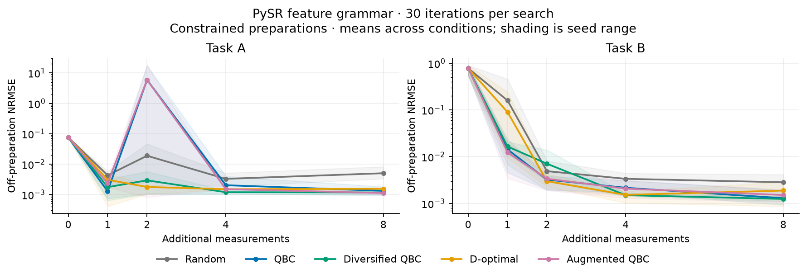

# CorrLaw overnight study — in progress

**Status at 22:47 UTC, 21 September 2026:** development and operational validation
are complete; the frozen 500-trajectory PySR confirmation is running, with its first
300 trajectories (three complete seeds) saved and no execution failures. Confirmation
results have not yet been audited or interpreted. This is not the final report.
New experiments stop at 01:30 UTC and the authorized work deadline is 02:30 UTC
(08:00 IST, 22 September).

The completed earlier finite-library report is preserved as
[PILOT_REPORT.md](PILOT_REPORT.md). It found no mean-AUC advantage for augmented QBC
against ordinary QBC, diversified QBC, or regularized D-optimal on its four-task
suite. Its conclusions apply to that declared finite-library implementation.

The overnight extension uses actual PySR over generic normalized feature terminals.
The [v3 protocol](../docs/PROTOCOL.md) and [75-file input freeze](../.research/freezes/v3.json)
were committed before opening new confirmation outcomes (scientific input commit
`5e27579`). The primary comparison has four tasks, five seeds, five acquisition
policies, exact/near preparations, output noise 0.01, and all preparation controls:
500 trajectories. The predeclared stronger-search tier has 100 matched trajectories,
with 100 rather than 30 iterations per search. Both give every policy three searches
per refit and a common 15-node arithmetic cap. All measurements are simulated.

[Revised development](pysr-development/tables.md) completed all 360 A/B trajectories.
Its [artifact audit](../results/runs/pysr-development-002/validation.json) checked
193,650 candidate records and 15,062 witness records without errors. These repeated
records across policies/budgets are not independent discoveries. The stronger A/B
profile completed 10 trajectories, passed its audit, and its preselected noisy B
trajectory [reproduced exactly](../results/runs/pysr-strong-development-replay-001/reproduction.json).
All 74 tests passed before freezing.

Development contains a substantial rational-model failure: ordinary and augmented
QBC both reach off-preparation RMSE 106.519 on one noisy A trajectory at budget two,
despite small same-preparation error. It remains in all averages. The saved spread
is high, so this is not false consensus under the declared threshold. See the
[development review](../.research/notes/pysr-development-review.md). Finite-value
checks do not establish global pole-freedom or boundedness.

The historical finite/prior diversified policy uses an extra ensemble fit: 18 fitting
paths versus 9 for the other policies. The new PySR comparison matches all policies
at three searches. The [method cost disclosure](../docs/METHOD.md) prevents interpreting
the historical comparison as equal total computation. Cross-engine changes also
include rational composition, search, candidate retention, and intervention weights.

The remaining declared work comprises primary/strong confirmation, full artifact
audits and exact replays, exploratory exhaustive-search and physical-prior diagnostics,
paired committee analysis, matched compute sensitivity, numerical report regeneration,
and a final evidence-linked interpretation. No positive or novel result is presumed.
The current process and exact recovery sequence are in
[the handoff](../.research/HANDOFF.md). Nothing has been pushed or published.
